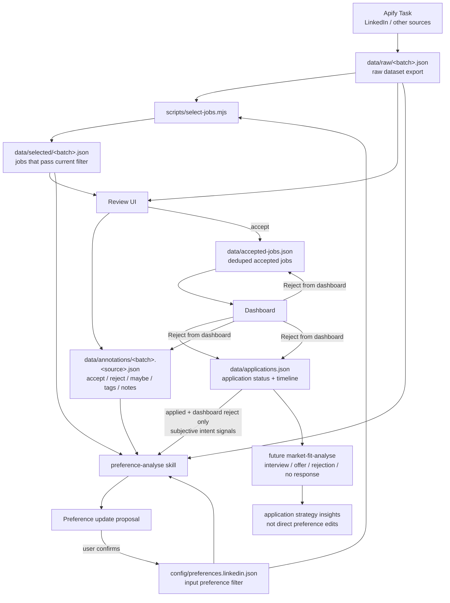
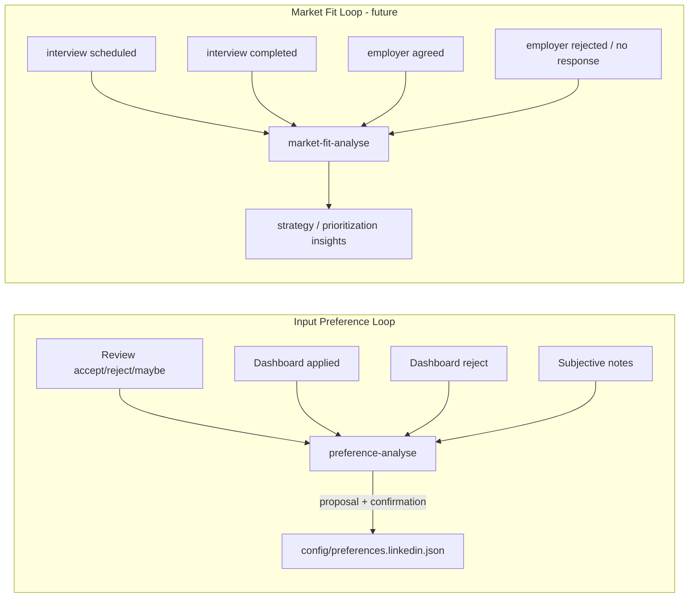

# Job Finder Pipeline

## End-to-End Architecture

```mermaid
flowchart TD
  A["Apify Task<br/>LinkedIn / other sources"] --> B["data/raw/&lt;batch&gt;.json<br/>raw dataset export"]

  B --> C["scripts/select-jobs.mjs"]
  P["config/preferences.linkedin.json<br/>input preference filter"] --> C
  C --> D["data/selected/&lt;batch&gt;.json<br/>jobs that pass current filter"]

  B --> E["Review UI"]
  D --> E
  E --> F["data/annotations/&lt;batch&gt;.&lt;source&gt;.json<br/>accept / reject / maybe / tags / notes"]

  E -- "accept" --> G["data/accepted-jobs.json<br/>deduped accepted jobs"]
  G --> H["Dashboard"]
  H --> I["data/applications.json<br/>application status + timeline"]

  H -- "Reject from dashboard" --> F
  H -- "Reject from dashboard" --> G
  H -- "Reject from dashboard" --> I

  F --> J["preference-analyse skill"]
  B --> J
  D --> J
  P --> J
  I -- "applied + dashboard reject only<br/>subjective intent signals" --> J

  J --> K["Preference update proposal"]
  K -- "user confirms" --> P

  I --> L["future market-fit-analyse<br/>interview / offer / rejection / no response"]
  L --> M["application strategy insights<br/>not direct preference edits"]
```

## Feedback Loops

```mermaid
flowchart LR
  subgraph "Input Preference Loop"
    A1["Review accept/reject/maybe"]
    A2["Dashboard applied"]
    A3["Dashboard reject"]
    A4["Subjective notes"]
    A5["preference-analyse"]
    A6["config/preferences.linkedin.json"]

    A1 --> A5
    A2 --> A5
    A3 --> A5
    A4 --> A5
    A5 -->|"proposal + confirmation"| A6
  end

  subgraph "Market Fit Loop - future"
    B1["interview scheduled"]
    B2["interview completed"]
    B3["employer agreed"]
    B4["employer rejected / no response"]
    B5["market-fit-analyse"]
    B6["strategy / prioritization insights"]

    B1 --> B5
    B2 --> B5
    B3 --> B5
    B4 --> B5
    B5 --> B6
  end
```
