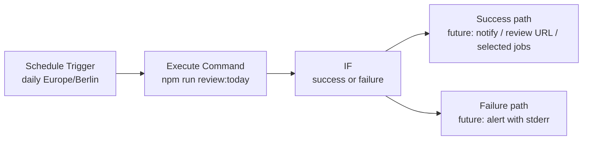

# n8n Daily Get Jobs Implementation Plan

> **For Codex:** REQUIRED SUB-SKILL: Use superpowers:executing-plans to implement this plan task-by-task.

**Goal:** Run the existing daily job collection command from local n8n on a daily schedule, then leave clear extension points for notification, review, and future automation actions.

**Architecture:** Use local npm-installed n8n as the scheduler and orchestration UI. The first workflow uses `Schedule Trigger` configured for `Europe/Berlin` to run once per day, then `Execute Command` to run `npm run review:today` inside `D:\CodeSpace\job-finder`; later nodes can consume generated JSON files or trigger downstream actions.

**Tech Stack:** n8n `2.8.4`, Windows PowerShell/cmd, Node.js `22.13.1`, npm, existing project script `npm run review:today`, existing data outputs under `data/raw`, `data/canonical`, and `data/selected`.

---

## Current State

- n8n is installed globally with npm.
- Installed n8n version: `2.8.4`.
- Existing project command: `npm run review:today`.
- Existing implementation entrypoint: `scripts/run-apify-review.mjs`.
- Existing test command: `npm test`.
- The daily command reads `.env`; do not copy token values into n8n workflow fields, logs, or documentation.

## Recommended First Workflow



## Task 1: Verify Local n8n Installation

**Files:**
- No repo file changes.

**Step 1: Check installed n8n version**

Run:

```powershell
n8n --version
```

Expected:

```text
2.8.4
```

**Step 2: Check project command still exists**

Run:

```powershell
npm run
```

Expected: output includes `review:today`.

**Step 3: Run project tests before wiring automation**

Run:

```powershell
npm test
```

Expected: all Node test runner tests pass.

## Task 2: Start n8n Locally With Required Settings

**Files:**
- No repo file changes for the first manual setup.
- Future optional helper: create `scripts/start-n8n-local.ps1` if repeated manual startup becomes annoying.

**Step 1: Start n8n with explicit instance timezone and Execute Command enabled**

Run:

```powershell
$env:GENERIC_TIMEZONE="Europe/Berlin"     # n8n expects an IANA timezone name
$env:NODES_EXCLUDE="[]"                   # ensures Execute Command node is available
n8n start
```

> `GENERIC_TIMEZONE` must be set explicitly — n8n self-hosted defaults to `America/New_York`, not the OS timezone. Do not use `(Get-TimeZone).Id` directly here: Windows returns IDs such as `W. Europe Standard Time`, while n8n expects an IANA timezone such as `Europe/Berlin`.

Expected:

- n8n starts without fatal errors.
- The editor is available at `http://localhost:5678`.

**Step 2: Complete first-user setup in the browser**

Open:

```text
http://localhost:5678
```

Expected:

- n8n asks for local owner account setup on first run.
- After setup, the workflow editor is accessible.

## Task 3: Create the Daily Get Jobs Workflow

**Files:**
- Workflow is stored in n8n's local data store (`~/.n8n/`) by default.
- After creating the workflow, export it via n8n UI (⋮ → Download) and save to `docs/n8n-workflows/daily-get-jobs.json` so it can be restored without rebuilding from scratch.

**Step 1: Create a new workflow**

Name:

```text
Daily Get Jobs
```

Expected: blank workflow canvas opens.

**Step 2: Add Schedule Trigger**

Node:

```text
Schedule Trigger
```

Settings:

```text
Trigger Interval: Days
Days Between Triggers: 1
Trigger at Hour: 8
Trigger at Minute: 0
Timezone: Europe/Berlin
```

Expected: node shows one daily trigger rule.

**Step 3: Add Execute Command**

Node:

```text
Execute Command
```

Settings:

```cmd
cd /d D:\CodeSpace\job-finder && npm run review:today
```

Recommended options:

```text
Execute Once: enabled
Settings -> Continue On Fail: enabled
```

> Enable "Continue On Fail" so that a non-zero exit code does not abort the workflow execution before reaching the IF node. Without it, a failed command marks the run as errored and the failure branch never fires.

Expected: manual execution runs the project command from the correct directory.

**Step 4: Connect the nodes**

Connect:

```text
Schedule Trigger -> Execute Command
```

Expected: workflow has one trigger and one command node.

## Task 4: Smoke Test the Workflow Manually

**Files:**
- Expected generated files:
  - `data/raw/...`
  - `data/canonical/YYYY-MM-DD.json`
  - `data/selected/YYYY-MM-DD.json`

**Step 1: Run the Execute Command node manually**

In n8n, select the Execute Command node and run it.

Expected:

- Execution finishes successfully.
- stdout includes the normal `review:today` progress.
- No `.env` token values appear in output.

**Step 2: Verify generated files**

Run:

```powershell
Get-ChildItem data\canonical,data\selected | Sort-Object LastWriteTime -Descending | Select-Object -First 10 FullName,LastWriteTime
```

Expected:

- Today's canonical JSON exists.
- Today's selected JSON exists.

**Step 3: Run project tests after one workflow execution**

Run:

```powershell
npm test
```

Expected: all tests pass.

## Task 5: Activate the Daily Schedule

**Files:**
- No repo file changes.

**Step 1: Save the workflow**

Expected: n8n accepts the workflow without validation errors.

**Step 2: Publish or activate the workflow**

Expected:

- Schedule Trigger is active.
- n8n shows the workflow as active.

**Step 3: Confirm timezone**

Check that the workflow-level timezone is set to:

```text
Europe/Berlin
```

n8n self-hosted defaults to `America/New_York` when `GENERIC_TIMEZONE` is absent, so the instance timezone must also be set explicitly at startup. Setting the workflow timezone to `Europe/Berlin` makes the workflow intent clear even if startup configuration changes later.

## Task 6: Make n8n Itself Run Reliably

**Files:**
- No repo file changes for the first pass.
- Future optional helper: `scripts/start-n8n-local.ps1`.

**Step 1: Choose a runtime mode**

Recommended first mode:

```text
Manual PowerShell session while validating the workflow.
```

Next stable mode:

```text
Windows Task Scheduler starts n8n at user login.
```

**Step 2: Add a Windows Task Scheduler entry after validation**

Program:

```text
powershell.exe
```

Arguments:

```powershell
-NoProfile -ExecutionPolicy Bypass -Command "$env:GENERIC_TIMEZONE='Europe/Berlin'; $env:NODES_EXCLUDE='[]'; n8n start"
```

Expected:

- n8n starts after login.
- `http://localhost:5678` is reachable.
- Active scheduled workflows run while the user session is available.

**Note:** Task Scheduler by default only runs tasks when the user is logged in. In the task's General settings, check "Run whether user is logged on or not" (requires storing credentials) if the machine may be locked but not signed out. Alternatively, use [nssm](https://nssm.cc/) to register n8n as a Windows service, which starts automatically on boot without requiring a login session.

## Task 7: Add Success and Failure Branches

**Files:**
- Workflow changes in n8n.
- No repo file changes required.

**Step 1: Add an IF node after Execute Command**

Condition:

```text
{{ $json.exitCode }} equals 0
```

Expected:

- Success branch handles completed daily collection.
- Failure branch handles command errors.

**Step 2: Success branch, first version**

Add a no-op or simple notification placeholder.

Initial recommended action:

```text
Record the execution in n8n history only.
```

Future actions:

- Send notification with selected job count.
- Open or link to local Review UI.
- Read `data/selected/YYYY-MM-DD.json` and push selected jobs to another destination.

**Step 3: Failure branch, first version**

Add a notification action later, such as email, Telegram, Discord, or another channel.

Message template:

```text
Daily Get Jobs failed.
Repository: D:\CodeSpace\job-finder
Command: npm run review:today
Execution: {{$execution.id}}
Error: {{$json.stderr || $json.error || "Unknown error"}}
```

Expected:

- Failures are visible without checking the n8n UI manually.

## Task 8: Future Extension Points

**Files:**
- Workflow changes in n8n.
- Optional future repo scripts if a stable machine-readable summary is needed.

**Extension A: selected jobs summary**

Add a small repo script later:

```text
scripts/summarize-selected-today.mjs
```

Purpose:

```text
Read data/selected/YYYY-MM-DD.json and print count, top matches, and output file paths as JSON.
```

Then call it from n8n after `review:today`.

**Extension B: Review UI link**

If the local app server is running:

```powershell
npm start
```

Then downstream messages can include:

```text
http://localhost:4173
```

Port is `4173` by default (`app/server.mjs:15`); override with `PORT` env var if needed.

**Extension C: downstream actions**

Candidate actions:

- Send selected jobs to email.
- Add rows to Google Sheets.
- Create GitHub issues for high-priority jobs.
- Send daily review prompt to Telegram or Discord.
- Trigger preference analysis after annotations exist.

Do not add these until the base scheduled collection is stable for several runs.

## Rollback Plan

**Stop n8n process:**

Press `Ctrl+C` in the terminal running n8n.

**Disable workflow:**

Open n8n and deactivate `Daily Get Jobs`.

**Remove global n8n if needed:**

```powershell
npm uninstall -g n8n
```

This does not delete project job data under `D:\CodeSpace\job-finder\data`.

## Done Definition

- `n8n --version` works and reports `2.8.4`.
- n8n starts locally at `http://localhost:5678`.
- Workflow `Daily Get Jobs` exists.
- Schedule Trigger is configured for one daily run in `Europe/Berlin`.
- Execute Command runs `cd /d D:\CodeSpace\job-finder && npm run review:today`.
- Manual workflow execution succeeds.
- Today's `data/canonical/YYYY-MM-DD.json` and `data/selected/YYYY-MM-DD.json` are generated.
- Workflow is saved and activated.
- A decision is made for how n8n itself stays running: manual while testing, Task Scheduler after validation.
